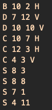

# Project Battleship Puzzle Generator
{{TOC}}

## 1. Introduction

In the **Battleship Puzzle Generator** (`bpg`) programming assignment your team should create a set of distinct Battleship puzzles and write them to an output file.

The quantity of puzzles and their dimensions should be specified by the user through command line arguments.

## 2. The puzzle

A single valid Battleship puzzle is a  `n x m` matrix that contains a set of  ships (_armada_) placed according to some rules.
For this project, in particular, a valid puzzle matrix may have any dimensions between 7 and 16 for rows or columns.
The armada is composed of 10 ships that your automatic generator needs to place on the matrix board. These ships  are:

* 01 Battleship, with length = 4 pieces.
* 02 Destroyers, with length = 3 pieces.
* 03 Cruisers, with length = 2 pieces.
* 04 Submarines, with length = 1 piece.

Each ship occupies their length in contiguous cells of the grid, arranged either _horizontally_ or _vertically_.
The ships are positioned in such a way that there are always cells representing water (i.e. unoccupied free cells) around any two ships.
In other words, a ship must not occupy a cell that is neighbour of another ship's cell, not even diagonally.
A ship may touch the edge of the matrix.


## 3. The task

You team should devise a data structure to **represent** a puzzle and a **strategy** to automatically place the armada's ship on a board to form a valid Battleship puzzle. Your program should generate as many puzzles as the user requested, up to a maximum of 100 puzzles.
The output should be send to two output files, described later in the [Output Section](#output).

Discuss with your partner which is the best approach to _represent_ and _place_ ships on the board, since one decision is intrinsically connected to the other.

## 4. Input

The program should run in a terminal as follows:

```
$.\bpg [<options>] <number_of_puzzles>
```

If the user provides any wrong input or calls the program with no parameters, the application should display the proper error message (if that is the case) and print out the help as follows:

```
$.\bpg 
	Usage: [<options>] <number_of_puzzles>
	  Program options are:
	    --rows <num>	Specify the number of rows for the matrix, with `<num>` in the range [7, 16 ]. The default value is 10.
	    --cols <num>	Specify the number of columns for the matrix, with `<num>` in the range [7,16]. The default value is 10.
	  Requested input is:
	    number_of_puzzles	The number of puzzles to be generated, in the range [1,100].
```

Note that the option parameters _may be specified in any order_, and the user may want puzzles with number of rows different from the number of columns.

In the situation below, the user wants 30,  `10x10` puzzles. Because the user omitted the dimensions, the application assumes the default values, which is 10 for both dimensions.
```
$.\bpg 30 
```


If the user provides invalid input, for instance, we should print the error message and the help, as follows:
```
$.\bpg 20 --rows 5
	bpg ERROR: ``invalid number of rows!``
	 
	Usage: [<options>] <number_of_puzzles>
	  Program options are:
	    --rows <num>	Specify the number of rows for the matrix, with `<num>` in the range [7, 16 ]. The default value is 10.
	    --cols <num>	Specify the number of columns for the matrix, with `<num>` in the range [7,16]. The default value is 10.
	  Requested input is:
	    number_of_puzzles	The number of puzzles to be generated, in the range [1,100].
```

## 5. Output

Your program should be able to produce **two** types of output files.

The first one is called `the matrix-format`. It contains an ascii representations of the entire board for each puzzle, so we can see the location and orientation of each individual  ship on the matrix-board. This is a convenient way of visualising the puzzles. Each puzzle should be  separated by a blank line. The columns and rows must  all have numbers to help identify each ship's coordinate.

The second format is called `the armada-format`. It contains a compact text representation for each puzzle. Each individual puzzle has 10 lines, one for each ship. A line has 4 fields separeted by a white space or tab: the first field is a single character representing the ship's  type, the next two fields are two integers representing the row-column coordinates of the first piece of the ship, and the last field is a single character representing the ship's orientation. In this format, we assume that all pieces of a ship are either placed towards the right of the ship's  origin coordinate when in a horizontal orientation; or towards the bottom of the ship's origin coordinate when in a vertical orientation.

The first two lines of both file formats are similar. The first line contains an integer representing the number of puzzles present in the file. The second line is composed of two integers separated by a white space of tab, and they correspond to the dimensions (i.e. row and columns) of the puzzles created by the application.

Here is an example of each type of output the should be created by the application. In this case we have generated 20,  `12x12` puzzles, that you may access [here](output/puzzles_matrix.bp) and [here](output/puzzles_armada.bp).

* This is the matrix-format.


* This is the corresponding armada-format.



## 5. Assignment Evaluation

The project has a total of 10 credits, distributed as follows:

1. Provides the correct textual user interface, as requested in this specification: 1 credit
2. Reads the input information correctly from the command line: 1 credit
3. Generates puzzles with the dimensions requested in this specification: 2 credits
4. Generates  `n` distinct puzzles, as requested by the user: 4 credits
5. Generates two output files: 2 credits

The following situations may **take credits out** of your assignment, if they happen during the evaluation process:
1.  Compiling and/or run time errors (up to -2 credits)
2.  Missing code documentation in Doxygen style (up to -1 credit)
3.  Memory leak (up to -1 credits)
4.  Missing README file (up to -2 credits).

The README file written in [Markdown](https://daringfireball.net/projects/markdown/) file format should contain a brief description of the game, and how to run it.
It also should describe possible errors, limitations, or issues found.
Do not forget to include the author(s) name(s)!

Extra credits may be awarded to those assignments which have able to create another program that reads the input puzzle file and display an interactive game.
An example of such interface may be found online [here](https://lukerissacher.com/battleships).

### 5.1 Good Programming Practices

During the development process of your assignment, it is  strongly recommend to use the following tools:-
1.  Doxygen: professional code documentation;
2.  Git: version control system;
3.  Valgrind: tracks memory leaks, among other features;
4.  gdb: debugging tool, and;
5.  Makefile: helps building and managing your programming projects.

Try to organize you code in several folders, such as `src`  (for `.cpp` files), `include` (for header files `.h`), `build` (for executable files) and `data` (for storing output files).


### 5.2 Authorship and Collaboration Policy

This is a pair assignment. You may work in a pair or alone. If you work as a pair, comment both members' names atop every code file, and try to balance evenly the workload. Only one of you should submit the program via Sigaa.

Any team may be called for an interview. The purpose of the interview is twofold: to confirm the authorship of the assignment and to identify the workload assign to each member. During the interview, any team member should be capable of explaining any piece of code, even if he or she has not written that particular piece of code. After the interview, the assignment's credits may be re-distributed to better reflect the true contribution of each team member.

The cooperation among students is strongly encouraged. It is accepted the open discussion of ideas or development strategies. Notice, however, that this type of interaction should not be understood as a free permission to copy and use somebody else's code. This is may be interpreted as plagiarism.

Any two (or more) programs deemed as plagiarism will automatically receive **zero** credits, regardless of the real authorship of the programs involved in the case. If your project uses a (small) piece of code from someone else's, please provide proper acknowledgment in the README file.


### 5.3 Work Submission

Only one team member should submit a single zip file containing the entire project. This should be done only via the proper link in the Sigaa's virtual class.
**Submission via email shall be ignored!**
